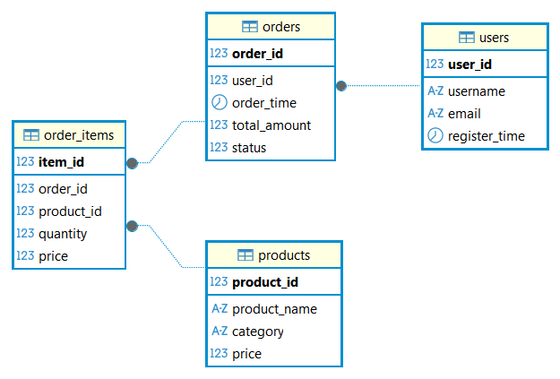
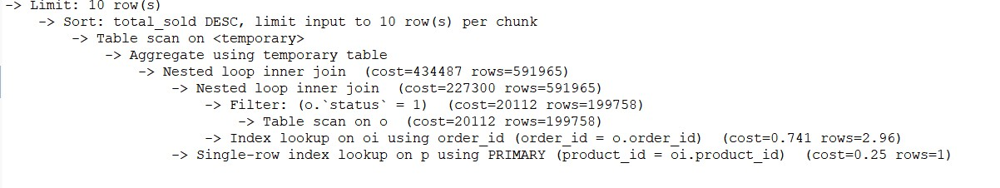
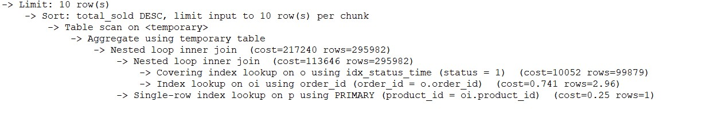
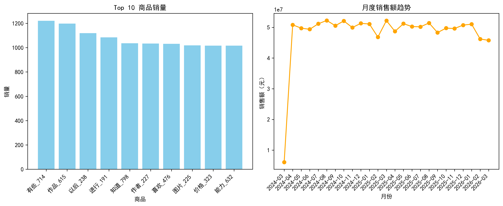

### 项目介绍

本项目模拟电商销售核心业务数据，构建用户、商品、订单、订单明细四张表，使用 Python 生成十万级测试数据，并通过 SQL 完成用户复购率、RFM 用户分层、商品销量排行及月度销售趋势分析，最后利用 Python 进行数据可视化。同时，通过`EXPLAIN` 分析慢查询并创建索引，显著提升了查询性能。

### 项目结构
ecom\_ana/

├── sql/

│   ├── 表格创建.sql     

│   ├── 月销售趋势.sql         

│   ├── 用户复购率.sql         

│   ├── RFM分析.sql          

│   ├── 销量排行.sql          

│   ├── 索引创建.sql          

│   ├── 索引创造前查找效果（模拟）.sql          

│   └── 索引后查找效果.sql      

├── images/

│   ├── ecommerce.png         #ER图      

│   ├── analysis_chart.png     #数据分析图  

│   ├── 索引建立前.jpg      

│   └── 索引建立后.jpg    

├── generate\_data.py           # 生成测试数据

├── visualize.py               # 数据可视化

├── requirements.txt           # Python 依赖

└── README.md                  # 项目说明

### 技术栈

数据库：MySQL 9.6

语言：Python 3.13

Python 库：pymysql、pandas、matplotlib、faker

工具：DBeaver、Git、MySQL 命令行

### ER图
 
 
### 优化效果

优化前（强制忽略索引）：Nested loop inner join，成本 434,487，扫描行数 591,965。
 
优化后（使用索引）：Covering index lookup，成本 10,052，扫描行数 99,879。

效率提升：查询成本降低约 97.7%，扫描行数减少 83%。

### 数据可视化

使用 Python（pandas + matplotlib）读取分析结果，生成图表：

## 项目亮点

- 完整的 ETL 流程：从数据库设计、数据生成到分析、可视化。
    
- 十万级数据量下的 SQL 优化实践，使用 `EXPLAIN` 和索引显著提升性能。
    
- 使用窗口函数（`NTILE`、`ROW_NUMBER`）完成 RFM 用户分层。

## 联系方式

如有问题，欢迎通过bingalbatross@gmail.com交流。

